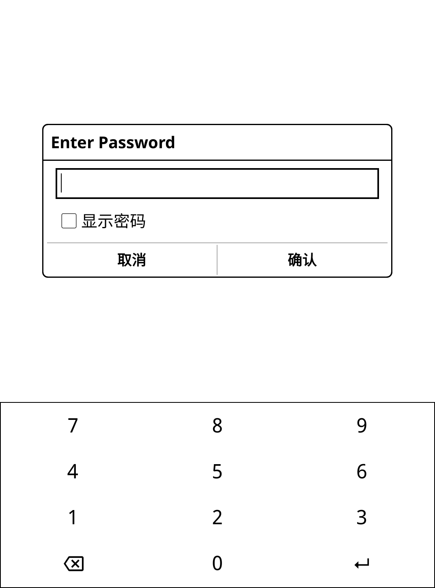

# KOReader Plugin: ScreenLock

This plugin adds a simple pin-based lock screen to KOReader.

> [!CAUTION]  
> This plugin provides **basic protection only**.  
> It is **not a security solution** and will not stop a determined or technically skilled attacker.  
> Do not rely on it to protect sensitive data.

## Features

- Lock KOReader with a password
- Automatically locks after device suspend / resume
- Optional blank (white) screen to hide document contents
- On-screen password keyboard
- Menu actions for locking and password management

## Installation

1. Copy the `screenlock.koplugin` folder into:
   ```
   koreader/plugins/
   ```
2. Start (or restart) KOReader.
3. Open the KOReader menu and select **ScreenLock**.

## Usage

### Lock the screen

- Open the KOReader menu
- Go to **ScreenLock**
- Select **Lock now**

> or

- Press power/lock button

### Change the password

- Open **ScreenLock** in the menu
- Select **Change password**
- Enter your current password, then set a new one

> **Default password:** `1234`

## Behavior Notes

- The lock screen **automatically activates when the device resumes from sleep**
- Pressing **Cancel** on the password prompt puts the device back to sleep
- If enabled, screen contents are hidden while locked

## Preview



## Limitations

- This plugin does **not encrypt files or memory**
- It only protects access within KOReader
- Removing the plugin or editing settings files can bypass the lock
