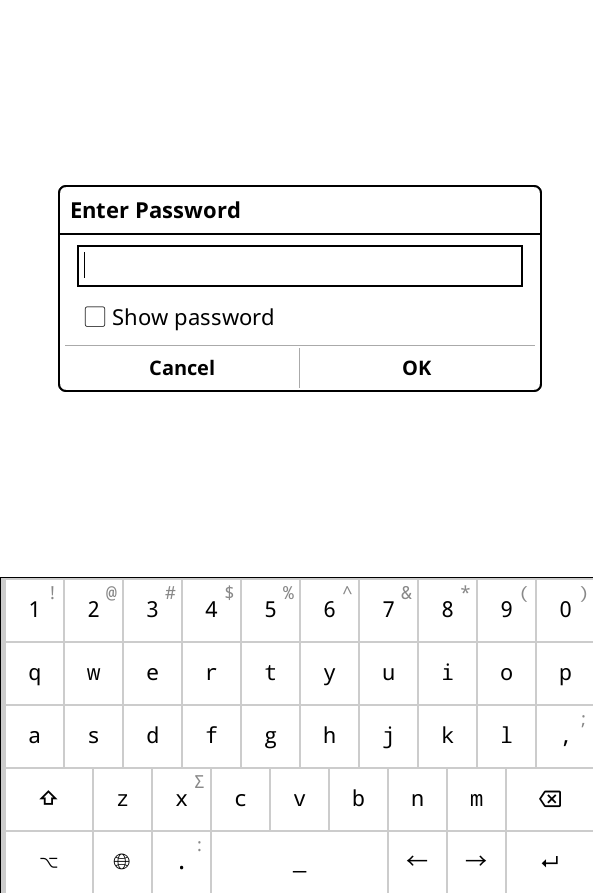

# KOReader Plugin: ScreenLock
This plugin lets you lock your screen with a password, either triggered from the menu or automatically upon device wake-up.

>
> [!CAUTION]  
> **This plugin is made for basic protection, not security — it may not protect your device from an experienced attacker. Always keep your device out of the hands of real threats.**
>

## Setup
1. Put `screenlock.koplugin` into the `kodreader/plugins` directory.
2. In KOReader, open the menu and select "Screenlock".
3. Press "Change password" to set your password. The default password is **1234**.

## Preview

## Note
The plugin will automatically activate on resume from suspend. There is also a **Screen Lock** menu entry.
